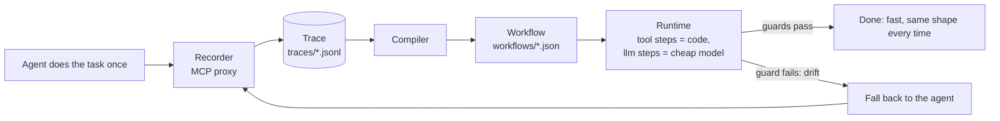
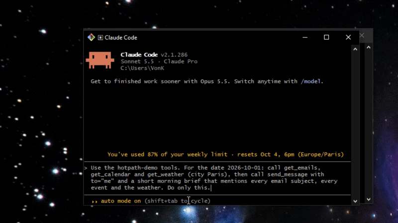

# Hotpath

**Record your AI agent once. Replay it faster and cheaper, with AI only where judgment is needed.**

## Why

- **Agents redo the same work, and you pay for it every run.** A morning brief or an inbox triage re-runs a frontier model through the same tool calls every single time.
- **Results differ each time.** The same task produces a slightly different sequence of tool calls and a differently shaped answer on every run.
- **Hotpath compiles the run into a visible, editable workflow.** Tool calls become plain code, an LLM is used only where judgment is needed, and when the world changes the workflow falls back to the agent, records a new trace and heals itself.

## Quick start

Needs Node 22+ and pnpm 9+. Runs on the bundled demo task (a fake "morning brief"); the demo tools never touch the real world — `send_message` writes to `out/messages.json`.

```bash
git clone https://github.com/mourad-baazi/hotpath.git
cd hotpath
pnpm install
pnpm -r build   # also builds the demo tools, which the demos start with plain node
cp .env.example .env
```

Edit `.env` and set `LLM_API_KEY`. Any OpenAI-compatible provider works (Groq, NVIDIA, Kimi/Moonshot, OpenAI, …) — set `LLM_BASE_URL` and the two model names to match, for example for Groq:

```bash
LLM_API_KEY=your-key
LLM_BASE_URL=https://api.groq.com/openai/v1
HOTPATH_AGENT_MODEL=openai/gpt-oss-120b   # the "expensive agent"
HOTPATH_CHEAP_MODEL=openai/gpt-oss-20b    # used by workflow llm steps
HOTPATH_CHEAP_REASONING=low               # optional: reasoning_effort for the cheap model (gpt-oss supports it)
```

Then record → compile → run → view:

```bash
# 1. record: the demo agent does the task once, through the recording proxy
pnpm --filter demo-agent start -- --task morning-brief --date 2026-10-01

# 2. compile the trace into workflows/morning-brief.json
pnpm hotpath compile morning-brief
pnpm hotpath show morning-brief

# 3. run the workflow (an LLM is called only at the one step that needs it)
pnpm hotpath run morning-brief --input date=2026-10-01

# 4. open the workflow graph in your browser
pnpm hotpath view morning-brief
```

`run` prints where the time went, so the deterministic part is visible:

```
✓ morning-brief in 0.6s, $0.0009 (1 llm call) · startup 219ms + tools 38ms + llm 384ms
```

(`startup` is spawning and connecting to the MCP server, `tools` is every tool step together, `llm` is the model call.) Use `--dry-run` on `run` to see what the side-effecting steps would send without sending anything.

A second, bigger demo task, `weekly-report` (13 tool calls, two LLM steps, data passed between steps), works the same way: `--task weekly-report --date 2026-10-04` for the agent, then `compile`, `run` and `view` with `weekly-report`.

## Use it with your own agent

Hotpath works with any agent that talks to MCP servers over stdio. It sits between the agent and the server, so the agent and the server need no changes.

**1. Wrap the MCP server.** `hotpath record` starts the real server as a child process and forwards every message in both directions, writing each tool call (arguments, result, timing) to a trace:

```bash
hotpath record --task inbox-triage -- npx -y @acme/inbox-mcp-server
#              ^ a name for this job     ^ the command that starts your MCP server
```

(From the Hotpath folder the CLI is run as `pnpm hotpath record …`; the config below does exactly that.)

**2. Point the agent's MCP config at the wrapped command** instead of the original server. The example uses the common `mcpServers` format (Claude Desktop and most MCP clients); only the `command`, `args` and `env` fields matter:

```json
{
  "mcpServers": {
    "inbox": {
      "command": "pnpm",
      "args": [
        "--silent",
        "--dir",
        "/absolute/path/to/hotpath",
        "hotpath",
        "record",
        "--task",
        "inbox-triage",
        "--",
        "npx",
        "-y",
        "@acme/inbox-mcp-server"
      ],
      "env": { "HOTPATH_INPUTS": "{\"date\":\"2026-10-01\"}" }
    }
  }
}
```

- Use absolute paths. `--dir` makes pnpm run inside the Hotpath folder, so any relative path in the wrapped command resolves there; `--silent` keeps pnpm's own output off the MCP channel.
- `HOTPATH_INPUTS` is a JSON object with the values that change between runs (a date, a customer id, …). The compiler turns every argument equal to one of them into `{{inputs.<name>}}`; without it those values are baked in as constants.
- Traces are written to `traces/<task>/` in the Hotpath folder.
- Tools count as side-effecting (and are skipped by `--dry-run`) unless the MCP server marks them `readOnlyHint: true`.

**3. Run the agent once, normally.** The task is recorded as it goes.

**4. Compile and run.**

```bash
pnpm hotpath compile inbox-triage            # trace -> workflows/inbox-triage.json
pnpm hotpath show inbox-triage               # review the steps
pnpm hotpath run inbox-triage --input date=2026-10-02 --dry-run
pnpm hotpath run inbox-triage --input date=2026-10-02
```

Workflows are plain JSON in `workflows/`; the steps, prompts and guards can be edited by hand.

**5. Register the task for drift fallback.** When a guard fails, Hotpath re-runs your agent to record a fresh trace and recompiles. It finds the agent through `hotpath.config.json`:

```json
{
  "tasks": {
    "inbox-triage": {
      "agent": "node my-agent/run.js",
      "server": "npx -y @acme/inbox-mcp-server"
    }
  }
}
```

- `agent` is the command that runs your agent for this task. Hotpath appends `--task <name> --<input> <value>` for each workflow input, for example `--task inbox-triage --date 2026-10-02`. The agent must reach its tools through `hotpath record` (step 2) so the fallback run is recorded.
- `server` is the command that starts the real MCP server; the bundled demo agent reads it to wrap the server with the recorder.
- Without an `agent` entry, run with `--no-fallback` so drift exits non-zero instead of falling back.

## How it works



1. **Record.** `hotpath record` is an MCP stdio proxy: every tool call the agent makes (arguments, result, timing) is written to a JSONL trace.
2. **Compile.** A deterministic compiler (no API key needed) turns the trace into a workflow: tool calls become `tool` steps, values that change between runs (like a date) become `{{inputs.*}}`, data passed between steps becomes `{{steps.*.result}}`, and text the agent wrote becomes an `llm` step. Each step gets a guard: a JSON schema inferred from the recorded result for tool steps; for LLM steps, non-empty / max-length plus a **grounding guard**: the compiler records which values from earlier results the example output mentions, and at run time the output must mention what those same fields hold _now_. If something is missing, the step is retried once with the missing items listed, and if it is still missing the guard fails like any other drift.
3. **Run.** The runtime executes the steps in order against the real MCP server. Only `llm` steps call a model, and they use the cheap one.
4. **Drift → recompile.** If a guard fails, the runtime stops, runs the agent once, backs up the old workflow as `workflows/<task>.<timestamp>.bak.json`, and recompiles from the fresh trace. It never falls back after a side-effecting step has already run, so a message can't be sent twice. If the recompiled workflow would have **lost read-only tool steps** the old one had (the agent skipped a data source this time), it warns and keeps the old workflow unless `--accept-recompile` is passed.

## Benchmark

Measured with `pnpm bench` on 2026-10-01 against real APIs on Groq: `qwen/qwen3.8-27b` as the agent and `openai/gpt-oss-20b` (`HOTPATH_CHEAP_REASONING=low`) as the workflow's cheap model. Unedited output of one complete run over the two demo tasks:

```
scenario                 agent time / cost                        hotpath time / cost                             startup + tools + llm  speedup  cheaper  match  fallback
morning-brief/same-data  3.7s / $0.0206                           0.9s / $0.0021                                  224ms + 37ms + 612ms   4x       10x      ✅      no
morning-brief/new-data   3.3s / $0.0175 (+15.0s rate-limit wait)  1.0s / $0.0018                                  241ms + 37ms + 746ms   3x       10x      ✅      no
morning-brief/drift      -                                        4.4s / $0.0175 (+28.0s rate-limit wait) → 0.7s  216ms + 39ms + 416ms   -        -        ✅      yes → recompiled
weekly-report/same-data  6.7s / $0.0503 (+61.0s rate-limit wait)  1.6s / $0.0039                                  219ms + 54ms + 1.3s    4x       13x      ✅      no
weekly-report/new-data   6.7s / $0.0438 (+74.0s rate-limit wait)  1.3s / $0.0038                                  216ms + 54ms + 986ms   5x       12x      ✅      no
weekly-report/drift      -                                        7.6s / $0.0499 (+54.0s rate-limit wait) → 1.1s  222ms + 55ms + 781ms   -        -        ✅      yes → recompiled
```

- Times exclude rate-limit waiting, which is shown beside the agent's time; speedups are computed without it (about 3–5x here).
- The deterministic part is nearly instant (tool steps 37–55 ms in total); the model call dominates the workflow's time.
- One run per scenario on small fake tasks, with placeholder per-token prices: not a statistical benchmark. Pass rates are available only for 2 runs, not the 3 intended.

Details, definitions of the scenarios and the full notes are in [`docs/BENCHMARK.md`](docs/BENCHMARK.md).

## CLI reference

| Command                                                                                    | What it does                                                                                                                                                                               |
| ------------------------------------------------------------------------------------------ | ------------------------------------------------------------------------------------------------------------------------------------------------------------------------------------------ |
| `hotpath record --task <name> -- <server command…>`                                        | Run an MCP stdio proxy that records an agent's tool calls to `traces/<task>/<timestamp>.jsonl`.                                                                                            |
| `hotpath compile <task> [--trace <file>]`                                                  | Compile a trace (default: the latest) into `workflows/<task>.json`.                                                                                                                        |
| `hotpath show <task>`                                                                      | Print a workflow as a readable list of steps.                                                                                                                                              |
| `hotpath run <task> [--input key=value…] [--dry-run] [--no-fallback] [--accept-recompile]` | Run a workflow. `--dry-run` skips side-effect steps; `--no-fallback` exits non-zero on drift; `--accept-recompile` replaces the workflow after a fallback even if it lost read-only steps. |
| `hotpath view <task> [--port <port>] [--no-open]`                                          | Open the workflow graph viewer (Vite + React Flow) on localhost.                                                                                                                           |
| `pnpm bench [--runs N] [--skip-agent] [--skip-agent-reruns] [--task <name>]`               | Run the end-to-end benchmark against a real LLM. `--runs N` repeats it and reports per-scenario pass rates.                                                                                |

In this repo the CLI is run as `pnpm hotpath <command>`. Tasks and their agent/server commands are defined in `hotpath.config.json`.

## Status and roadmap

MVP. Straight-line workflows only (no branching or loops), two demo tasks, no browser/UI automation.

Next: OpenClaw plugin, Claude Code recorder, Hotpath Hub, cloud.

The full spec is in [`docs/SPEC.md`](docs/SPEC.md) and per-milestone status in [`docs/PROGRESS.md`](docs/PROGRESS.md).

## Contributing

Contributions are welcome — see [`CONTRIBUTING.md`](CONTRIBUTING.md). In short: one milestone-sized change per PR, tests first, and `pnpm -r build && pnpm -r test && pnpm lint` must pass.

## License

[Apache-2.0](LICENSE) © 2026 Mourad Baazi

<!--
TODO: record the demo GIF (record → compile → run → view on the morning-brief
task), save it as docs/demo.gif, and add it under the title at the top:


-->
