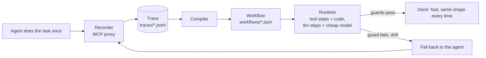

# Hotpath

**Record your AI agent once. Replay it faster and cheaper, with AI only where judgment is needed.**


<!-- TODO: record the demo GIF (record → compile → run → view on the morning-brief task) and save it as docs/demo.gif -->

## Why

- **Agents redo the same work, and you pay for it every run.** A morning brief or an inbox triage re-runs a frontier model through the same tool calls every single time.
- **Results differ each time.** The same task produces a slightly different sequence of tool calls and a differently shaped answer on every run.
- **Hotpath compiles the run into a visible, editable workflow.** Tool calls become plain code, an LLM is used only where judgment is needed, and when the world changes the workflow falls back to the agent, records a new trace and heals itself.

## Quick start

Needs Node 22+ and pnpm 9+. Runs on the bundled demo task (a fake "morning brief"); the demo tools never touch the real world — `send_message` writes to `out/messages.json`.

```bash
git clone https://github.com/mourad-baazi/hotpath.git
cd hotpath
pnpm install
pnpm -r build   # also builds the demo tools, which the demos start with plain node
cp .env.example .env
```

Edit `.env` and set `LLM_API_KEY`. Any OpenAI-compatible provider works (Groq, NVIDIA, Kimi/Moonshot, OpenAI, …) — set `LLM_BASE_URL` and the two model names to match, for example for Groq:

```bash
LLM_API_KEY=your-key
LLM_BASE_URL=https://api.groq.com/openai/v1
HOTPATH_AGENT_MODEL=openai/gpt-oss-120b   # the "expensive agent"
HOTPATH_CHEAP_MODEL=openai/gpt-oss-20b    # used by workflow llm steps
HOTPATH_CHEAP_REASONING=low               # optional: reasoning_effort for the cheap model (gpt-oss supports it)
```

Then record → compile → run → view:

```bash
# 1. record: the demo agent does the task once, through the recording proxy
pnpm --filter demo-agent start -- --task morning-brief --date 2026-10-01

# 2. compile the trace into workflows/morning-brief.json
pnpm hotpath compile morning-brief
pnpm hotpath show morning-brief

# 3. run the workflow (an LLM is called only at the one step that needs it)
pnpm hotpath run morning-brief --input date=2026-10-01

# 4. open the workflow graph in your browser
pnpm hotpath view morning-brief
```

`run` prints where the time went, so you can see that the deterministic part is nearly instant:

```
✓ morning-brief in 0.6s, $0.0009 (1 llm call) · startup 219ms + tools 38ms + llm 384ms
```

(`startup` is spawning and connecting to the MCP server, `tools` is every tool step together, `llm` is the model call.) Use `--dry-run` on `run` to see what the side-effecting steps would send without sending anything.

There is a second, bigger demo task, `weekly-report` (13 tool calls, two LLM steps, data passed between steps). Use it the same way: `--task weekly-report --date 2026-10-04` for the agent, then `compile`/`run`/`view weekly-report`.

## How it works



1. **Record.** `hotpath record` is an MCP stdio proxy: every tool call the agent makes (arguments, result, timing) is written to a JSONL trace.
2. **Compile.** A deterministic compiler (no API key needed) turns the trace into a workflow: tool calls become `tool` steps, values that change between runs (like a date) become `{{inputs.*}}`, data passed between steps becomes `{{steps.*.result}}`, and text the agent wrote becomes an `llm` step. Each step gets a guard: a JSON schema inferred from the recorded result for tool steps; for LLM steps, non-empty / max-length plus a **grounding guard**: the compiler records which values from earlier results the example output mentions, and at run time the output must mention what those same fields hold _now_. If something is missing, the step is retried once with the missing items listed, and if it is still missing the guard fails like any other drift.
3. **Run.** The runtime executes the steps in order against the real MCP server. Only `llm` steps call a model, and they use the cheap one.
4. **Drift → recompile.** If a guard fails, the runtime stops, runs the agent once, backs up the old workflow as `workflows/<task>.<timestamp>.bak.json`, and recompiles from the fresh trace. It never falls back after a side-effecting step has already run, so a message can't be sent twice. If the recompiled workflow would have **lost read-only tool steps** the old one had (the agent skipped a data source this time), it warns and keeps the old workflow unless you pass `--accept-recompile`.

## Benchmark

Produced by `pnpm bench` (real API calls) on **2026-10-01**, all on Groq: `qwen/qwen3.8-27b` as the agent and `openai/gpt-oss-20b` (with `HOTPATH_CHEAP_REASONING=low`) as the workflow's cheap model. Two demo tasks: `morning-brief` (4 tool calls, 1 LLM step) and `weekly-report` (13 tool calls, 2 LLM steps). This is the unedited output of one complete run:

```
scenario                 agent time / cost                        hotpath time / cost                             startup + tools + llm  speedup  cheaper  match  fallback
morning-brief/same-data  3.7s / $0.0206                           0.9s / $0.0021                                  224ms + 37ms + 612ms   4x       10x      ✅      no
morning-brief/new-data   3.3s / $0.0175 (+15.0s rate-limit wait)  1.0s / $0.0018                                  241ms + 37ms + 746ms   3x       10x      ✅      no
morning-brief/drift      -                                        4.4s / $0.0175 (+28.0s rate-limit wait) → 0.7s  216ms + 39ms + 416ms   -        -        ✅      yes → recompiled
weekly-report/same-data  6.7s / $0.0503 (+61.0s rate-limit wait)  1.6s / $0.0039                                  219ms + 54ms + 1.3s    4x       13x      ✅      no
weekly-report/new-data   6.7s / $0.0438 (+74.0s rate-limit wait)  1.3s / $0.0038                                  216ms + 54ms + 986ms   5x       12x      ✅      no
weekly-report/drift      -                                        7.6s / $0.0499 (+54.0s rate-limit wait) → 1.1s  222ms + 55ms + 781ms   -        -        ✅      yes → recompiled
```

- **Times exclude rate-limit waiting.** Groq's free tier throttles tokens per minute, and the client retries when it is hit. That waiting is measured (`rateLimitWaitMs`) and shown beside the agent's time instead of being counted in it, and the speedup is computed from the time _without_ it. The waiting here was large (up to 74 s on one agent run), so earlier numbers that included it overstated the gap: without the waiting, the agent takes about 3–4 s for `morning-brief` and about 6.7 s for `weekly-report` on this provider, and the workflow is about **3–5x faster**.
- **startup + tools + llm** is where the workflow's time goes: starting and connecting to the MCP server (~220 ms), all the deterministic tool steps together (37–55 ms in total), and the LLM steps. The deterministic part is nearly instant; the model call is what takes the time.
- **same-data**: the workflow made the same tool calls as the recorded trace (ignoring the LLM-written text) and the output mentioned everything it should.
- **new-data**: the same workflow on different data, with no agent involved and no recompilation.
- **drift**: a field was renamed (`subject` → `title` for morning-brief, repo `name` → `slug` for weekly-report). The guard caught it at step `s1`, the agent ran once, the workflow was recompiled, and the next run passed with no fallback. The first time is the fallback run including the agent, the time after the arrow is the following clean run.
- Costs are computed from the per-token prices configured in `.env` (`PRICE_*`), not from your provider's invoice. This run used the defaults in `.env.example` (agent $3 / $15, cheap $0.95 / $4 per million input / output tokens), which are placeholders rather than Groq's actual prices, so the "cheaper" ratio is only as meaningful as those prices.

### Pass rates

The LLM parts are not deterministic, so a single run proves little. `pnpm bench --runs N` repeats everything and reports per-scenario pass rates. Over the **two complete runs** I could do on the final code (the same day, same models):

| scenario                | passed |
| ----------------------- | ------ |
| morning-brief/same-data | 2/2    |
| morning-brief/new-data  | 2/2    |
| morning-brief/drift     | 2/2    |
| weekly-report/same-data | 2/2    |
| weekly-report/new-data  | 2/2    |
| weekly-report/drift     | 1/1    |

That is a very small sample (2 runs), not a statistical claim, and it is **not the 3 runs I intended**:

- In the second run, the `weekly-report/drift` agent call was refused by Groq's **daily token limit** (200,000 tokens/day on this account); a full benchmark spends roughly 85,000 agent tokens, so the limit stopped a third run. That scenario is excluded from the table (1/1) instead of being counted as either a pass or a failure.
- Earlier runs today used code from before the grounding guard and the recompile check, and some missed an item in the output (the cheap model leaving something out). They are not included here. The grounding guard (below) exists to catch exactly that.
- To get real pass rates, run `pnpm bench --runs 3` yourself (with an agent model that is not rate limited, or after the daily limit resets); `--skip-agent-reruns` saves the comparison agent run in runs 2..N.

## CLI reference

| Command                                                               | What it does                                                                                    |
| --------------------------------------------------------------------- | ----------------------------------------------------------------------------------------------- |
| `hotpath record --task <name> -- <server command…>`                   | Run an MCP stdio proxy that records an agent's tool calls to `traces/<task>/<timestamp>.jsonl`. |
| `hotpath compile <task> [--trace <file>]`                             | Compile a trace (default: the latest) into `workflows/<task>.json`.                             |
| `hotpath show <task>`                                                 | Print a workflow as a readable list of steps.                                                   |
| `hotpath run <task> [--input key=value…] [--dry-run] [--no-fallback] [--accept-recompile]` | Run a workflow. `--dry-run` skips side-effect steps; `--no-fallback` exits non-zero on drift; `--accept-recompile` replaces the workflow after a fallback even if the recompile lost read-only steps. |
| `hotpath view <task> [--port <port>] [--no-open]`                     | Open the workflow graph viewer (Vite + React Flow) on localhost.                                |
| `pnpm bench [--runs N] [--skip-agent] [--skip-agent-reruns] [--task <name>]` | Run the end-to-end benchmark against a real LLM. `--runs N` repeats it and reports per-scenario pass rates. |

In this repo the CLI is run as `pnpm hotpath <command>`. Tasks and their agent/server commands are defined in `hotpath.config.json`.

## Status and roadmap

MVP. Straight-line workflows only (no branching or loops), one demo task, no browser/UI automation.

Next: OpenClaw plugin, Claude Code recorder, Hotpath Hub, cloud.

The full spec is in [`SPEC.md`](SPEC.md) and per-milestone status in [`PROGRESS.md`](PROGRESS.md).

## Contributing

Contributions are welcome — see [`CONTRIBUTING.md`](CONTRIBUTING.md). In short: one milestone-sized change per PR, tests first, and `pnpm -r build && pnpm -r test && pnpm lint` must pass.

## License

[Apache-2.0](LICENSE) © 2026 Mourad Baazi
