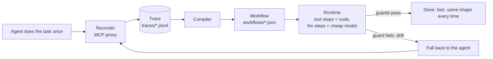

# Hotpath

**Record your AI agent once. Replay it faster and cheaper, with AI only where judgment is needed.**


<!-- TODO: record the demo GIF (record → compile → run → view on the morning-brief task) and save it as docs/demo.gif -->

## Why

- **Agents redo the same work, and you pay for it every run.** A morning brief or an inbox triage re-runs a frontier model through the same tool calls every single time.
- **Results differ each time.** The same task produces a slightly different sequence of tool calls and a differently shaped answer on every run.
- **Hotpath compiles the run into a visible, editable workflow.** Tool calls become plain code, an LLM is used only where judgment is needed, and when the world changes the workflow falls back to the agent, records a new trace and heals itself.

## Quick start

Needs Node 22+ and pnpm 9+. Runs on the bundled demo task (a fake "morning brief"); the demo tools never touch the real world — `send_message` writes to `out/messages.json`.

```bash
git clone https://github.com/mourad-baazi/hotpath.git
cd hotpath
pnpm install
cp .env.example .env
```

Edit `.env` and set `LLM_API_KEY`. Any OpenAI-compatible provider works (Groq, NVIDIA, Kimi/Moonshot, OpenAI, …) — set `LLM_BASE_URL` and the two model names to match, for example for Groq:

```bash
LLM_API_KEY=your-key
LLM_BASE_URL=https://api.groq.com/openai/v1
HOTPATH_AGENT_MODEL=openai/gpt-oss-120b   # the "expensive agent"
HOTPATH_CHEAP_MODEL=openai/gpt-oss-20b    # used by workflow llm steps
```

Then record → compile → run → view:

```bash
# 1. record: the demo agent does the task once, through the recording proxy
pnpm --filter demo-agent start -- --task morning-brief --date 2026-10-01

# 2. compile the trace into workflows/morning-brief.json
pnpm hotpath compile morning-brief
pnpm hotpath show morning-brief

# 3. run the workflow (an LLM is called only at the one step that needs it)
pnpm hotpath run morning-brief --input date=2026-10-01

# 4. open the workflow graph in your browser
pnpm hotpath view morning-brief
```

Use `--dry-run` on `run` to see what the side-effecting steps would send without sending anything.

## How it works



1. **Record.** `hotpath record` is an MCP stdio proxy: every tool call the agent makes (arguments, result, timing) is written to a JSONL trace.
2. **Compile.** A deterministic compiler (no API key needed) turns the trace into a workflow: tool calls become `tool` steps, values that change between runs (like a date) become `{{inputs.*}}`, data passed between steps becomes `{{steps.*.result}}`, and text the agent wrote becomes an `llm` step. Each step gets a guard (a JSON schema inferred from the recorded result, or non-empty / max-length for LLM output).
3. **Run.** The runtime executes the steps in order against the real MCP server. Only `llm` steps call a model, and they use the cheap one.
4. **Drift → recompile.** If a guard fails, the runtime stops, runs the agent once, backs up the old workflow as `workflows/<task>.<timestamp>.bak.json`, and recompiles from the fresh trace. It never falls back after a side-effecting step has already run, so a message can't be sent twice.

## Benchmark

Produced by `pnpm bench` (real API calls) on **2026-10-01**, with `openai/gpt-oss-120b` as the agent and `openai/gpt-oss-20b` as the workflow's cheap model, both on Groq. This is the unedited output of a single run:

```
scenario   agent time / cost  hotpath time / cost    speedup  cheaper  match  fallback
same-data  5.0s / $0.0163     2.3s / $0.0029         2x       6x       ✅      no
new-data   5.3s / $0.0145     2.3s / $0.0021         2x       7x       ✅      no
drift      -                  7.4s / $0.0159 → 2.2s  -        -        ✅      yes → recompiled
```

- **same-data**: the workflow made the same tool calls as the recorded trace and the brief mentioned everything it should.
- **new-data**: the same workflow, run on different data, with no agent involved and no recompilation.
- **drift**: the email field was renamed (`subject` → `title`); the guard caught it at step `s1`, the agent ran once, the workflow was recompiled, and the next run passed with no fallback (`7.4s / $0.0159` is the fallback run including the agent, `2.2s` is the following clean run).

Read these numbers with care:

- It is one run per scenario on a tiny task, not a statistical benchmark.
- Costs are computed from the per-token prices configured in `.env` (`PRICE_*`), not from your provider's invoice. These runs used the defaults in `.env.example` (agent $3 / $15, cheap $0.95 / $4 per million input / output tokens), which are placeholders rather than Groq's actual prices. Set your own to get real dollar figures.
- Groq is very fast, so the agent's baseline is only about 5 seconds here, and the cheap model spends hundreds of tokens on reasoning. The speedup is therefore modest (about 2x); the gap should grow with slower models and longer tasks, but that is not measured here.

## CLI reference

| Command                                                               | What it does                                                                                    |
| --------------------------------------------------------------------- | ----------------------------------------------------------------------------------------------- |
| `hotpath record --task <name> -- <server command…>`                   | Run an MCP stdio proxy that records an agent's tool calls to `traces/<task>/<timestamp>.jsonl`. |
| `hotpath compile <task> [--trace <file>]`                             | Compile a trace (default: the latest) into `workflows/<task>.json`.                             |
| `hotpath show <task>`                                                 | Print a workflow as a readable list of steps.                                                   |
| `hotpath run <task> [--input key=value…] [--dry-run] [--no-fallback]` | Run a workflow. `--dry-run` skips side-effect steps; `--no-fallback` exits non-zero on drift.   |
| `hotpath view <task> [--port <port>] [--no-open]`                     | Open the workflow graph viewer (Vite + React Flow) on localhost.                                |
| `pnpm bench [--skip-agent]`                                           | Run the end-to-end benchmark against a real LLM.                                                |

In this repo the CLI is run as `pnpm hotpath <command>`. Tasks and their agent/server commands are defined in `hotpath.config.json`.

## Status and roadmap

MVP. Straight-line workflows only (no branching or loops), one demo task, no browser/UI automation.

Next: OpenClaw plugin, Claude Code recorder, Hotpath Hub, cloud.

The full spec is in [`SPEC.md`](SPEC.md) and per-milestone status in [`PROGRESS.md`](PROGRESS.md).

## Contributing

Contributions are welcome — see [`CONTRIBUTING.md`](CONTRIBUTING.md). In short: one milestone-sized change per PR, tests first, and `pnpm -r build && pnpm -r test && pnpm lint` must pass.

## License

[Apache-2.0](LICENSE) © 2026 Mourad Baazi
