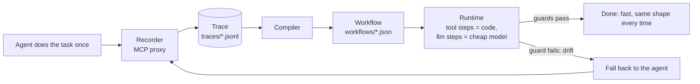

# Hotpath

**Record your AI agent once. Replay it faster and cheaper, with AI only where judgment is needed.**


<!-- TODO: record the demo GIF (record → compile → run → view on the morning-brief task) and save it as docs/demo.gif -->

## Why

- **Agents redo the same work, and you pay for it every run.** A morning brief or an inbox triage re-runs a frontier model through the same tool calls every single time.
- **Results differ each time.** The same task produces a slightly different sequence of tool calls and a differently shaped answer on every run.
- **Hotpath compiles the run into a visible, editable workflow.** Tool calls become plain code, an LLM is used only where judgment is needed, and when the world changes the workflow falls back to the agent, records a new trace and heals itself.

## Quick start

Needs Node 22+ and pnpm 9+. Runs on the bundled demo task (a fake "morning brief"); the demo tools never touch the real world — `send_message` writes to `out/messages.json`.

```bash
git clone https://github.com/mourad-baazi/hotpath.git
cd hotpath
pnpm install
pnpm -r build   # also builds the demo tools, which the demos start with plain node
cp .env.example .env
```

Edit `.env` and set `LLM_API_KEY`. Any OpenAI-compatible provider works (Groq, NVIDIA, Kimi/Moonshot, OpenAI, …) — set `LLM_BASE_URL` and the two model names to match, for example for Groq:

```bash
LLM_API_KEY=your-key
LLM_BASE_URL=https://api.groq.com/openai/v1
HOTPATH_AGENT_MODEL=openai/gpt-oss-120b   # the "expensive agent"
HOTPATH_CHEAP_MODEL=openai/gpt-oss-20b    # used by workflow llm steps
HOTPATH_CHEAP_REASONING=low               # optional: reasoning_effort for the cheap model (gpt-oss supports it)
```

Then record → compile → run → view:

```bash
# 1. record: the demo agent does the task once, through the recording proxy
pnpm --filter demo-agent start -- --task morning-brief --date 2026-10-01

# 2. compile the trace into workflows/morning-brief.json
pnpm hotpath compile morning-brief
pnpm hotpath show morning-brief

# 3. run the workflow (an LLM is called only at the one step that needs it)
pnpm hotpath run morning-brief --input date=2026-10-01

# 4. open the workflow graph in your browser
pnpm hotpath view morning-brief
```

`run` prints where the time went, so you can see that the deterministic part is nearly instant:

```
✓ morning-brief in 0.6s, $0.0009 (1 llm call) · startup 219ms + tools 38ms + llm 384ms
```

(`startup` is spawning and connecting to the MCP server, `tools` is every tool step together, `llm` is the model call.) Use `--dry-run` on `run` to see what the side-effecting steps would send without sending anything.

There is a second, bigger demo task, `weekly-report` (13 tool calls, two LLM steps, data passed between steps). Use it the same way: `--task weekly-report --date 2026-10-04` for the agent, then `compile`/`run`/`view weekly-report`.

## How it works



1. **Record.** `hotpath record` is an MCP stdio proxy: every tool call the agent makes (arguments, result, timing) is written to a JSONL trace.
2. **Compile.** A deterministic compiler (no API key needed) turns the trace into a workflow: tool calls become `tool` steps, values that change between runs (like a date) become `{{inputs.*}}`, data passed between steps becomes `{{steps.*.result}}`, and text the agent wrote becomes an `llm` step. Each step gets a guard (a JSON schema inferred from the recorded result, or non-empty / max-length for LLM output).
3. **Run.** The runtime executes the steps in order against the real MCP server. Only `llm` steps call a model, and they use the cheap one.
4. **Drift → recompile.** If a guard fails, the runtime stops, runs the agent once, backs up the old workflow as `workflows/<task>.<timestamp>.bak.json`, and recompiles from the fresh trace. It never falls back after a side-effecting step has already run, so a message can't be sent twice.

## Benchmark

Produced by `pnpm bench` (real API calls) on **2026-10-01**, all on Groq: `qwen/qwen3.8-27b` as the agent, `openai/gpt-oss-20b` (with `HOTPATH_CHEAP_REASONING=low`) as the workflow's cheap model. This is the unedited output of a single run, for the two demo tasks (`morning-brief`: 4 tool calls and 1 LLM step; `weekly-report`: 13 tool calls and 2 LLM steps):

```
scenario                 agent time / cost  hotpath time / cost     startup + tools + llm  speedup  cheaper  match  fallback
morning-brief/same-data  15.4s / $0.0194    0.8s / $0.0016          218ms + 35ms + 509ms   20x      12x      ✅      no
morning-brief/new-data   34.9s / $0.0187    0.8s / $0.0014          217ms + 36ms + 585ms   41x      13x      ✅      no
morning-brief/drift      -                  38.6s / $0.0191 → 0.8s  218ms + 38ms + 545ms   -        -        ✅      yes → recompiled
weekly-report/same-data  75.7s / $0.0444    1.4s / $0.0041          216ms + 55ms + 1.1s    55x      11x      ✅      no
weekly-report/new-data   78.7s / $0.0468    1.1s / $0.0039          218ms + 57ms + 860ms   69x      12x      ✅      no
weekly-report/drift      -                  70.5s / $0.0539 → 1.3s  247ms + 67ms + 1.0s    -        -        ✅      yes → recompiled
```

- **same-data**: the workflow made the same tool calls as the recorded trace (ignoring the LLM-written text) and the output mentioned everything it should.
- **new-data**: the same workflow on different data (different emails, different repositories and incident), with no agent involved and no recompilation.
- **drift**: a field was renamed (`subject` → `title` for morning-brief, repo `name` → `slug` for weekly-report). The guard caught it at step `s1`, the agent ran once, the workflow was recompiled, and the next run passed with no fallback. The first time is the fallback run including the agent, the time after the arrow is the following clean run.
- **startup + tools + llm** is where the workflow's time goes: starting and connecting to the MCP server, all the deterministic tool steps together, and the LLM steps. The tool steps take roughly 35–70 ms in total; almost all of the rest is the one model call per message.

Read these numbers with care:

- It is one run per scenario on small fake tasks, not a statistical benchmark, and the LLM parts are not deterministic. During development, individual scenarios occasionally failed on a missing mention (the cheap model leaving out an item); this table is one complete passing run, not an average.
- **The agent timings are noisy and partly inflated by rate limits.** Groq's free tier limits tokens per minute, and the client retries when it is hit, so some agent runs include waiting. A standalone `morning-brief` agent run with the same model took about 3.4 s, versus 15–35 s here, so the `morning-brief` speedups (20x, 41x) overstate the real gap. The `weekly-report` agent runs (about 75 s for 13 sequential tool calls) are mostly genuine model latency but we cannot separate out any rate-limit waiting.
- Costs are computed from the per-token prices configured in `.env` (`PRICE_*`), not from your provider's invoice. This run used the defaults in `.env.example` (agent $3 / $15, cheap $0.95 / $4 per million input / output tokens), which are placeholders rather than Groq's actual prices. Set your own to get real dollar figures; the "cheaper" ratio is only as meaningful as those prices.
- The first run of the day used `openai/gpt-oss-120b` as the agent, but it hit Groq's daily token limit before the benchmark could finish, so the agent was switched to `qwen/qwen3.8-27b` for this run.

## CLI reference

| Command                                                               | What it does                                                                                    |
| --------------------------------------------------------------------- | ----------------------------------------------------------------------------------------------- |
| `hotpath record --task <name> -- <server command…>`                   | Run an MCP stdio proxy that records an agent's tool calls to `traces/<task>/<timestamp>.jsonl`. |
| `hotpath compile <task> [--trace <file>]`                             | Compile a trace (default: the latest) into `workflows/<task>.json`.                             |
| `hotpath show <task>`                                                 | Print a workflow as a readable list of steps.                                                   |
| `hotpath run <task> [--input key=value…] [--dry-run] [--no-fallback]` | Run a workflow. `--dry-run` skips side-effect steps; `--no-fallback` exits non-zero on drift.   |
| `hotpath view <task> [--port <port>] [--no-open]`                     | Open the workflow graph viewer (Vite + React Flow) on localhost.                                |
| `pnpm bench [--skip-agent]`                                           | Run the end-to-end benchmark against a real LLM.                                                |

In this repo the CLI is run as `pnpm hotpath <command>`. Tasks and their agent/server commands are defined in `hotpath.config.json`.

## Status and roadmap

MVP. Straight-line workflows only (no branching or loops), one demo task, no browser/UI automation.

Next: OpenClaw plugin, Claude Code recorder, Hotpath Hub, cloud.

The full spec is in [`SPEC.md`](SPEC.md) and per-milestone status in [`PROGRESS.md`](PROGRESS.md).

## Contributing

Contributions are welcome — see [`CONTRIBUTING.md`](CONTRIBUTING.md). In short: one milestone-sized change per PR, tests first, and `pnpm -r build && pnpm -r test && pnpm lint` must pass.

## License

[Apache-2.0](LICENSE) © 2026 Mourad Baazi
